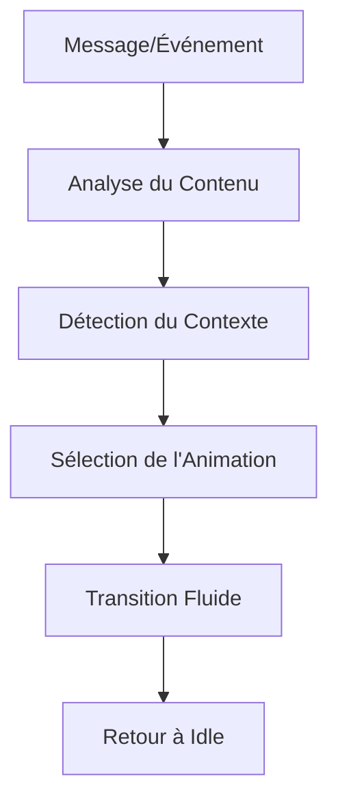

# 🎭 Système d'Animation Intelligent pour Avatar 3D

## Vue d'ensemble

Le système d'animation intelligent analyse automatiquement le contexte de la conversation et déclenche les animations appropriées pour l'avatar 3D en fonction :
- Du contenu des messages (salutations, adieux, questions)
- De l'état de la conversation (écoute, réflexion, parole)
- Du timing et de la séquence des interactions

## Animations Supportées

Votre avatar 3D GLTF doit contenir les animations suivantes créées dans Blender :

### 🎬 Animations Principales
- **`Idle`** - Animation de repos/attente
- **`Hello`** - Animation de salutation/bienvenue
- **`Talk`** - Animation pendant que l'IA parle
- **`Think`** - Animation de réflexion/traitement
- **`Bye`** - Animation d'au revoir/fin

### 🎯 Animations Context Détectées

| Animation | Déclencheurs | Durée |
|-----------|-------------|-------|
| `hello` | - Début de conversation<br>- Mots: "bonjour", "salut", "hello" | 2-3 secondes |
| `bye` | - Fin de conversation<br>- Mots: "au revoir", "bye", "à bientôt" | 2-3 secondes |
| `talking` | - Messages de l'assistant<br>- Réponses normales | Selon longueur du message |
| `thinking` | - Traitement en cours<br>- Mots: "je réfléchis", "hmm", "voyons" | 2-4 secondes |
| `listening` | - Enregistrement utilisateur<br>- Attente de réponse | Continuous |
| `idle` | - État de repos<br>- Par défaut | Continuous |

## Service d'Animation

Le `AnimationService` (`/src/utils/animationService.ts`) fournit :

### 🧠 Analyse Intelligente
```typescript
// Analyse le contenu d'un message
AnimationService.analyzeMessage(content, context)

// Analyse l'état global de la conversation
AnimationService.analyzeConversationState(isRecording, isProcessing, lastMessage)

// Crée des séquences d'animations temporelles
AnimationService.createAnimationSequence(initialState, duration)
```

### 🎪 Détection Contextuelle
- **Salutations** : Détecte les mots de bienvenue dans toutes les langues
- **Adieux** : Reconnaissance des expressions de fin de conversation  
- **Questions** : Analyse les mots interrogatifs et la ponctuation
- **Réflexion** : Expressions d'hésitation et de traitement

## Configuration Avatar 3D

### 📁 Structure des Fichiers
```
votre-avatar.gltf
├── Géométrie (meshes)
├── Matériaux (textures)
└── Animations
    ├── Idle.001        // Animation de base
    ├── Hello.001       // Salutation
    ├── Talk.001        // Parole
    ├── Think.001       // Réflexion
    └── Bye.001         // Au revoir
```

### 🔧 Nommage des Animations (Blender)
Les animations doivent être nommées avec ces mots-clés (insensible à la casse) :
- `idle`, `rest` → Animation de repos
- `hello`, `wave`, `greeting` → Salutation
- `talk`, `speak` → Parole
- `think`, `ponder` → Réflexion
- `bye`, `goodbye`, `farewell` → Au revoir

### ⚙️ Configuration Dashboard
1. Allez dans **Dashboard Brain** → **Configuration IA**
2. Uploadez votre fichier GLTF dans "Avatar URL"
3. Ajustez position, échelle et rotation si nécessaire

## Logique d'Animation

### 🔄 Flux de Déclenchement


### ⏱️ Gestion Temporelle
- **Hello/Bye** : 2-3 secondes puis retour à `idle`
- **Talking** : Durée basée sur la longueur du message (50ms/caractère)
- **Thinking** : 2-4 secondes maximum
- **Listening** : Continue pendant l'enregistrement

### 🎛️ Paramètres Avancés
```typescript
// Dans AnimationService
private static greetingWords = ['bonjour', 'hello', 'salut', ...]
private static farewellWords = ['au revoir', 'bye', 'adieu', ...]
private static thinkingWords = ['hmm', 'je réfléchis', 'voyons', ...]
```

## Débogage

### 🔍 Logs Console
```javascript
console.log('🎭 Animation change:', oldState, '->', newState, 'for message:', content)
console.log('🎭 State animation change:', oldState, '->', conversationState)
```

### 🛠️ Troubleshooting

| Problème | Cause Possible | Solution |
|----------|---------------|----------|
| Pas d'animation | Noms incorrects dans GLTF | Vérifier nommage Blender |
| Animation bloquée | Erreur de transition | Vérifier console pour erreurs |
| Mauvaise animation | Mots-clés non détectés | Ajouter synonymes dans `AnimationService` |

## Exemples d'Usage

### 🎯 Scénarios Typiques

1. **Début de conversation**
   ```
   Utilisateur clique "Converser"
   → Animation: hello (2s) → listening
   ```

2. **Message utilisateur**
   ```
   Utilisateur parle
   → Animation: listening → thinking → talking → idle
   ```

3. **Fin de conversation**
   ```
   Utilisateur dit "au revoir"
   → Animation: bye (3s) → idle
   ```

## Personnalisation

### 🎨 Ajouter de Nouvelles Animations
1. Créez l'animation dans Blender
2. Exportez le GLTF mis à jour
3. Ajoutez le nouveau type dans `AnimationState`
4. Modifiez `Avatar3D.tsx` pour le mapping
5. Étendez `AnimationService` pour la détection

### 🌍 Support Multilingue
Ajoutez des mots-clés dans `AnimationService` :
```typescript
private static greetingWords = [
  'bonjour', 'hello', 'hola', 'guten tag', 'ciao'
]
```

Le système est conçu pour être extensible et s'adapter à vos besoins spécifiques ! 🚀